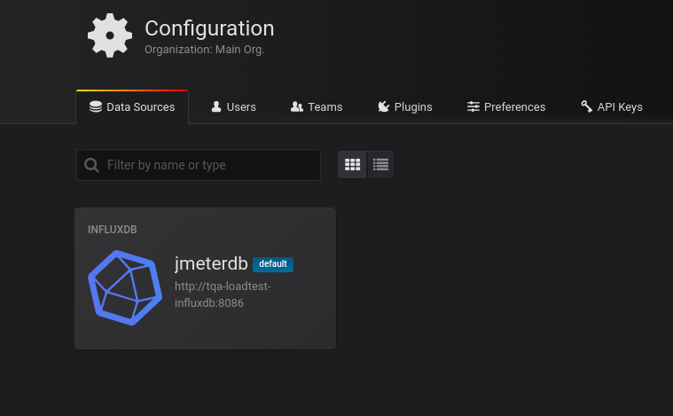
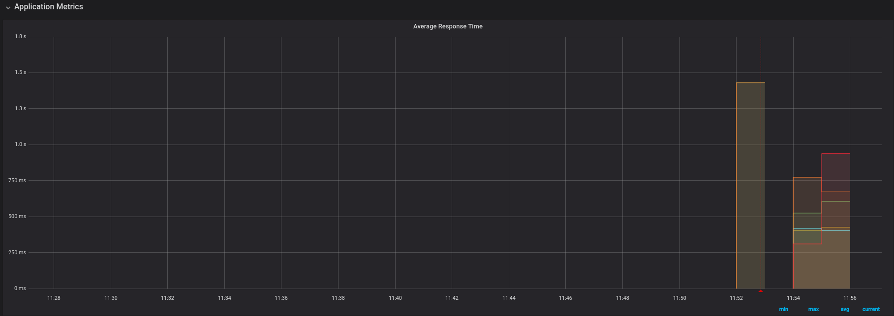

# Jmeter-operator

This operator was created to simplify the process of deploying a Jmeter cluster on kubernetes.

The operator is capable of creating the following resources:

    - Jmeter Master
    - Jmeter Slaves
    - InfluxDB for metrics storage (optional)
    - Grafana to visualize the load testing metrics (optional)
    - Grafana reporter module, this is used to generate PDF reports of your load tests (optional)

This effort is based partially on https://github.com/kubernauts/jmeter-kubernetes, if you desire an alternative deployment experience, you can check the repo further.

The steps to use this operator is as follows:

(1.) Clone this repo "**git clone https://github.com/kubernauts/jmeter-operator.git**"

(2.) Install the Jmeter CRD (custom resource definition):
"**kubectl apply -f deploy/crds/loadtest_v1alpha1_jmeter_crd.yaml**".
This is a cluster-wide scope operator, the reason for this is that multiple Jmeter clusters may be needed within an organization but there is nothing stopping you from using just one Jmeter deployment but it is strongly advised that you run it in a dedicated namespace which will we will as we proceed

(3.) Confirm that the CRD has been installed "**kubectl get crd | grep jmeter" or "kubectl describe crd jmeters.loadtest.jmeter.com**"

From "**_kubectl describe crd jmeters.loadtest.jmeter.com_**", you should below as part of the output:

```
Group:   loadtest.jmeter.com
  Names:
    Kind:       Jmeter
    List Kind:  JmeterList
    Plural:     jmeters
    Singular:   jmeter
  Scope:        Namespaced
  Subresources:
    Status:
  Version:  v1alpha1
  Versions:
    Name:     v1alpha1
    Served:   true
    Storage:  true
Status:
  Accepted Names:
    Kind:       Jmeter
    List Kind:  JmeterList
    Plural:     jmeters
    Singular:   jmeter
  Conditions:
```

(4.) Deploy the Jmeter operator deployment "kubectl apply -f deploy/" , this is what will watch the API for any jmeter CRD objects, once it detects the jmeter CRD, it will proceed to process that request and create the necessary kubernetes objects

Check the status fo the operator deployment (this is deployed in kube-system namespace by default)

kubectl -n kube-system get pods | grep jmeter

```
jmeter-operator-6f54d969c7-w4h4l 1/1 Running 0 2m

```

(5.) Create a namespace for the jmeter deployment: "**kubectl create namespace tqa**"

(6.) Create a Jmeter deployment manifest (e.g jmeter-deploy.yaml), example is given below:

```
apiVersion: loadtest.jmeter.com/v1alpha1
kind: Jmeter
metadata:
  name: tqa-loadtest
  namespace: tqa
spec:
  # Add fields here
  slave_size: 2
  jmeter_master_image: kubernautslabs/jmeter_master:latest
  jmeter_slave_image: kubernautslabs/jmeter_slave:latest
  grafana_server_root: /
  grafana_service_type: LoadBalancer
  grafana_image: grafana/grafana:5.2.0
  influxdb_image: influxdb
  grafana_install: "true"
  grafana_reporter_install: "false"
  grafana_reporter_image: kubernautslabs/jmeter-reporter:latest
  influxdb_install: "true"
```

Run "**kubectl create -f jmeter-deploy.yaml**". As you can see, you can enable optional features and also modify some parameters like service type for the Grafana deployment (e.g. you can set this to ClusterIP if you want to expose the service via an Ingress) and the container images.

N.B -- The "grafana_service_type" controls the kind of service type for both Grafana and Grafana Reporter

Confirm that the resources have been created:

**kubectl -n tqa get jmeter**

```
NAME           AGE
tqa-loadtest   1m
```

**kubectl -n tqa get all**

```
NAME                                             READY   STATUS    RESTARTS   AGE
pod/tqa-loadtest-grafana-dc9749dc9-4ggxg         1/1     Running   0          3m
pod/tqa-loadtest-influxdb-78b6c859cd-jstps       1/1     Running   0          3m
pod/tqa-loadtest-jmeter-master-66c648668-htdml   1/1     Running   0          3m
pod/tqa-loadtest-jmeter-slaves-c4787d59-275bj    1/1     Running   0          3m
pod/tqa-loadtest-jmeter-slaves-c4787d59-fptrp    1/1     Running   0          3m

NAME                                     TYPE           CLUSTER-IP      EXTERNAL-IP                                                                  PORT(S)                      AGE
service/tqa-loadtest-grafana             LoadBalancer   100.64.222.93   ac6d0c369489dxxxxxxxxxxx-198965xxxx.eu-central-1.elb.amazonaws.com   3000:30882/TCP               3m
service/tqa-loadtest-influxdb            ClusterIP      100.64.232.50   <none>                                                                       8083/TCP,8086/TCP,2003/TCP   3m
service/tqa-loadtest-jmeter-slaves-svc   ClusterIP      None            <none>                                                                       1099/TCP,50000/TCP           3m

NAME                                         DESIRED   CURRENT   UP-TO-DATE   AVAILABLE   AGE
deployment.apps/tqa-loadtest-grafana         1         1         1            1           3m
deployment.apps/tqa-loadtest-influxdb        1         1         1            1           3m
deployment.apps/tqa-loadtest-jmeter-master   1         1         1            1           3m
deployment.apps/tqa-loadtest-jmeter-slaves   2         2         2            2           3m

NAME                                                   DESIRED   CURRENT   READY   AGE
replicaset.apps/tqa-loadtest-grafana-dc9749dc9         1         1         1       3m
replicaset.apps/tqa-loadtest-influxdb-78b6c859cd       1         1         1       3m
replicaset.apps/tqa-loadtest-jmeter-master-66c648668   1         1         1       3m
replicaset.apps/tqa-loadtest-jmeter-slaves-c4787d59    2         2         2       3m

```

(7.) The next step is entirely optional, they are just to make creating a Jmeter load test easier, the scripts (**initialize_cluster.sh and start_test.sh**) can be modified to suit your needs as you desire.

The initialize_cluster.sh script will create the database name in InfluxDB (default name is 'jmeter') and also create the InfluxDB datasource in Grafana.

The script will ask you about the namespace where the jmeter cluster was created (tqa) and then proceed to create the needed resources in InfluxDB and Grafana.

```./initialize_cluster.sh
./initialize_cluster.sh

Enter the Jmeter Namespace: tqa
Creating Influxdb jmeter Database
Creating the Influxdb data source
{"datasource":{"id":1,"orgId":1,"name":"jmeterdb","type":"influxdb","typeLogoUrl":"","access":"proxy","url":"http://tqa-loadtest-influxdb:8086","password":"admin","user":"admin","database":"jmeter","basicAuth":false,"basicAuthUser":"","basicAuthPassword":"","withCredentials":false,"isDefault":true,"secureJsonFields":{},"version":1,"readOnly":false},"id":1,"message":"Datasource added","name":"jmeterdb"}
```

(8.) You can access your Grafana now and confirm whether the datasource was created.



(9.) Run a sample jmeter test script (there is a sample test script cloudssky.jmx in this repo). This can be initiated by running "**./start_test.sh**".

```
./start_test.sh
Enter the Jmeter Namespace: tqa
Enter path to the jmx file cloudssky.jmx
Mar 17, 2019 10:37:19 AM java.util.prefs.FileSystemPreferences$1 run
INFO: Created user preferences directory.
Creating summariser <summary>
Created the tree successfully using cloudssky.jmx
Configuring remote engine: 100.96.1.107
Configuring remote engine: 100.96.3.207
Starting remote engines
Starting the test @ Sun Mar 17 10:37:19 UTC 2019 (1552819039563)
Remote engines have been started
Waiting for possible Shutdown/StopTestNow/Heapdump message on port 4445
```

N.B - It is important that you configure your script with the appropriate InfluxDB service name (tqa-loadtest-influxdb as per this documentation), sample is shown below:

```
<stringProp name="Argument.value">http://tqa-loadtest-influxdb:8086/write?db=jmeter</stringProp>
```

Normally you will set this via the Jmeter desktop application to make this easier.

Otherwise the graphs on Grafana may not show anything!

(10.) Import the sample jmeter Grafana dashboard (GrafanaJMeterTemplate.json) and select the InfluxDB datasource that was created. Check the progress of the test:



To learn more about the Grafana reporter module and how to make use of ti, you can check the following blog post:

<https://goo.gl/mkoX9E>

```

```
